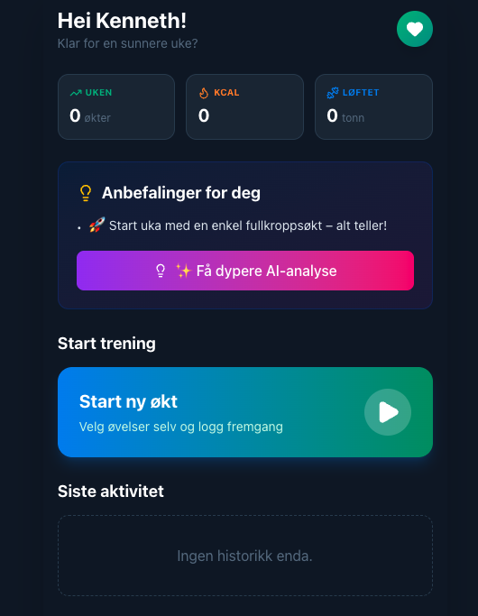
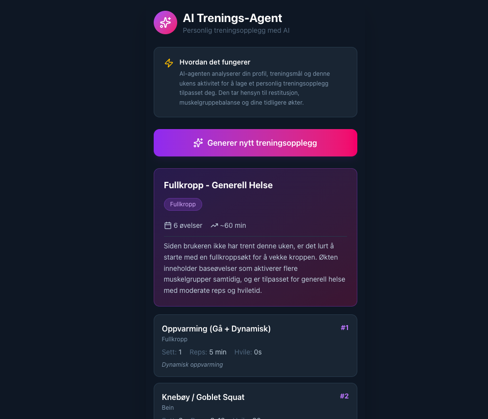
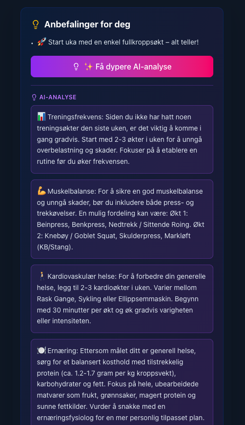
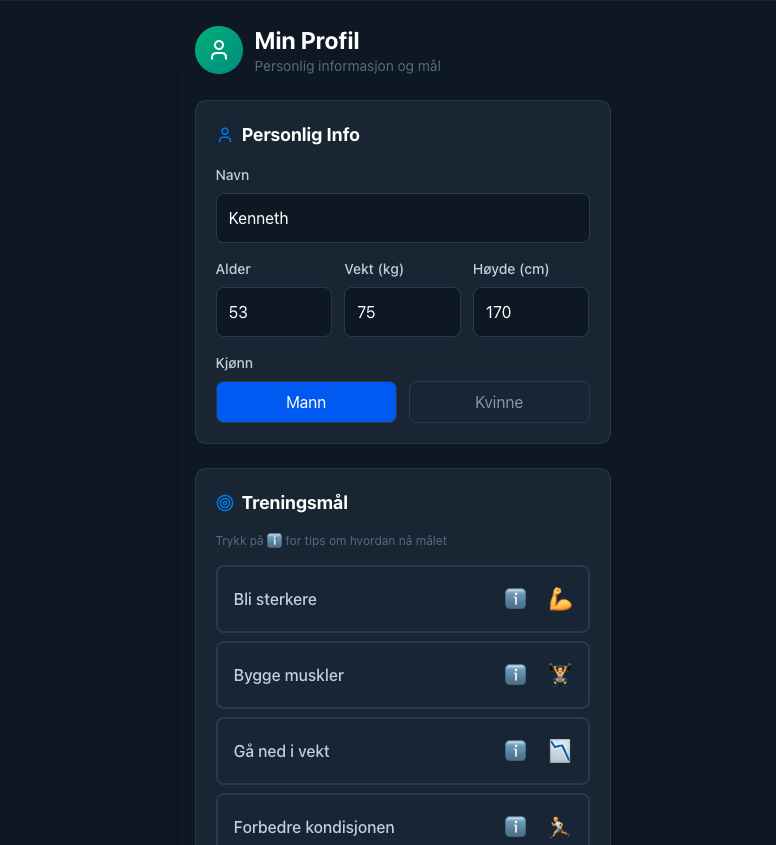
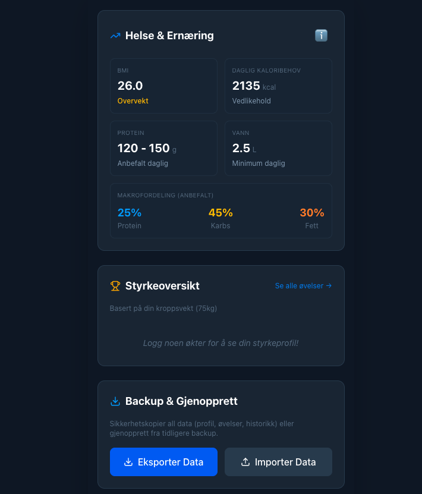
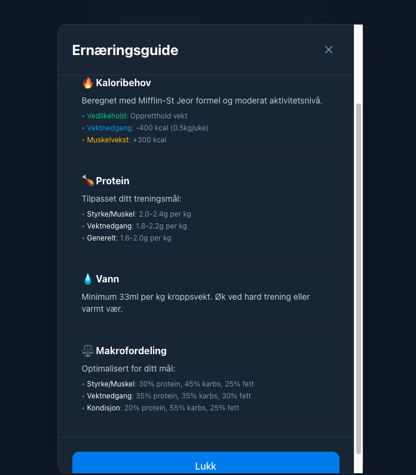

# 💪 Treningsappen - AI-drevet Treningsdagbok

En moderne Progressive Web App (PWA) for treningstracking med AI-genererte treningsopplegg.

## 📸 Screenshots

<details>
<summary>Klikk for å se skjermbilder</summary>

| Forside | Dashboard | KI-trening |
|---------|-----------|------------|
|  |  |  |

| KI-anbefaling | Profil | Ernæring |
|---------------|--------|----------|
|  |  |  |

| Ernæringsguide | Om appen |
|----------------|----------|
|  |  |

</details>

## ✨ Funksjoner

- 📊 **Treningslogging** - Logg økter med øvelser, sett, reps og vekt
- 📈 **Fremgangsvisualisering** - Se din utvikling med interaktive grafer
- 🤖 **AI Trenings-Agent** - Få personlige treningsopplegg generert av AI basert på din treningshistorikk
- 💡 **Smarte anbefalinger** - AI-drevne anbefalinger for neste økt
- ⏱️ **Innebygget timer** - Automatisk hviletid-tracking mellom sett
- 📱 **PWA** - Installer på mobil/desktop, fungerer offline
- 🎨 **Moderne UI** - Dark mode, responsive design

## 🚀 Kom i gang

### Forutsetninger

- Node.js (versjon 18 eller nyere)
- npm eller yarn
- En Gemini API-nøkkel (gratis tier tilgjengelig)

### Installasjon

1. **Klon repoet**
   ```bash
   git clone https://github.com/barx10/https-github.com-barx10-treningsappen.git
   cd https-github.com-barx10-treningsappen
   ```

2. **Installer avhengigheter**
   ```bash
   npm install
   ```

3. **Sett opp Gemini API-nøkkel**
   
   a. Få en gratis API-nøkkel fra [Google AI Studio](https://aistudio.google.com/apikey)
   
   b. Opprett en `.env` fil i prosjektets rotmappe:
   ```bash
   cp .env.example .env
   ```
   
   c. Åpne `.env` og legg inn din API-nøkkel:
   ```
   GEMINI_API_KEY=din_api_nøkkel_her
   ```

4. **Start utviklingsserver**
   ```bash
   npm run dev
   ```

5. **Åpne appen i nettleseren**
   ```
   http://localhost:5173
   ```

## 📦 Bygg for produksjon

```bash
npm run build
```

Bygget ender opp i `dist/` mappen.

## 🌐 Deploy til Vercel

1. **Push til GitHub** (hvis ikke allerede gjort)

2. **Gå til [Vercel](https://vercel.com)**
   - Logg inn med GitHub
   - Klikk "Add New Project"
   - Import ditt repository

3. **Sett Environment Variables**
   - Gå til Project Settings → Environment Variables
   - Legg til:
     - Name: `GEMINI_API_KEY`
     - Value: Din Gemini API-nøkkel
     - Environments: Production, Preview, Development (velg alle)

4. **Deploy**
   - Vercel vil automatisk bygge og deploye
   - Fremtidige pushes til main-branch vil automatisk deployes

## 🛠️ Teknologi

- **Frontend:** React 19, TypeScript, Vite
- **Styling:** Tailwind CSS 4
- **AI:** Google Gemini 2.0 Flash (via @google/genai)
- **Charts:** Recharts
- **Icons:** Lucide React
- **PWA:** vite-plugin-pwa
- **Deployment:** Vercel (serverless functions)

## 📱 Bruk som PWA

### På mobil (iOS/Android):
1. Åpne appen i Safari/Chrome
2. Trykk "Del" / "Meny"
3. Velg "Legg til på hjemskjerm"

### På desktop:
1. Åpne appen i Chrome/Edge
2. Klikk på install-ikonet i adressefeltet
3. Eller: Meny → "Installer [appnavn]"

## 🤖 AI-funksjoner

Appen bruker Google Gemini 2.0 Flash for:

- **Treningsopplegg**: Genererer personlige økter basert på:
  - Dine mål (styrke, muskelvekst, kondisjon)
  - Treningshistorikk (unngår overtrening)
  - Tilgjengelige øvelser i biblioteket
  
- **Smarte anbefalinger**: Foreslår neste øvelse basert på muskelgrupper du har trent

### Kostnad
Gemini 2.0 Flash er **gratis** opp til 1500 requests/dag (15 requests/minutt).  
[Les mer om prising](https://ai.google.dev/pricing)

## 📁 Prosjektstruktur

```
├── api/
│   └── generate-workout.js    # Vercel serverless function for AI
├── components/
│   ├── ActiveSessionView.tsx  # Aktiv treningsøkt
│   ├── AgentView.tsx          # AI-genererte opplegg
│   ├── ExerciseCard.tsx       # Øvelseskort
│   ├── ProfileView.tsx        # Brukerprofil og innstillinger
│   └── ...
├── utils/
│   ├── storage.ts             # LocalStorage handling
│   ├── initialData.ts         # Standardøvelser
│   └── fitnessCalculations.ts # 1RM, volum, etc.
├── App.tsx                    # Hovedapp
└── types.ts                   # TypeScript types
```

## 🔒 Personvern

- All data lagres lokalt i nettleserens localStorage
- Ingen brukerdata sendes til eksterne servere (unntatt AI-requests til Gemini)
- API-nøkkelen lagres trygt som miljøvariabel på serveren

## 📄 Lisens

MIT License - bruk fritt, men gi gjerne credits! 😊

## 👨‍💻 Laget av

Kenneth Bareksten - [Lærerliv](https://www.laererliv.no/)

## 🙏 Credits

- Google Gemini for AI-funksjonalitet
- Vercel for hosting
- React, TypeScript, Tailwind CSS communities

---

**Liker du prosjektet?** Gi det en ⭐ på GitHub!
